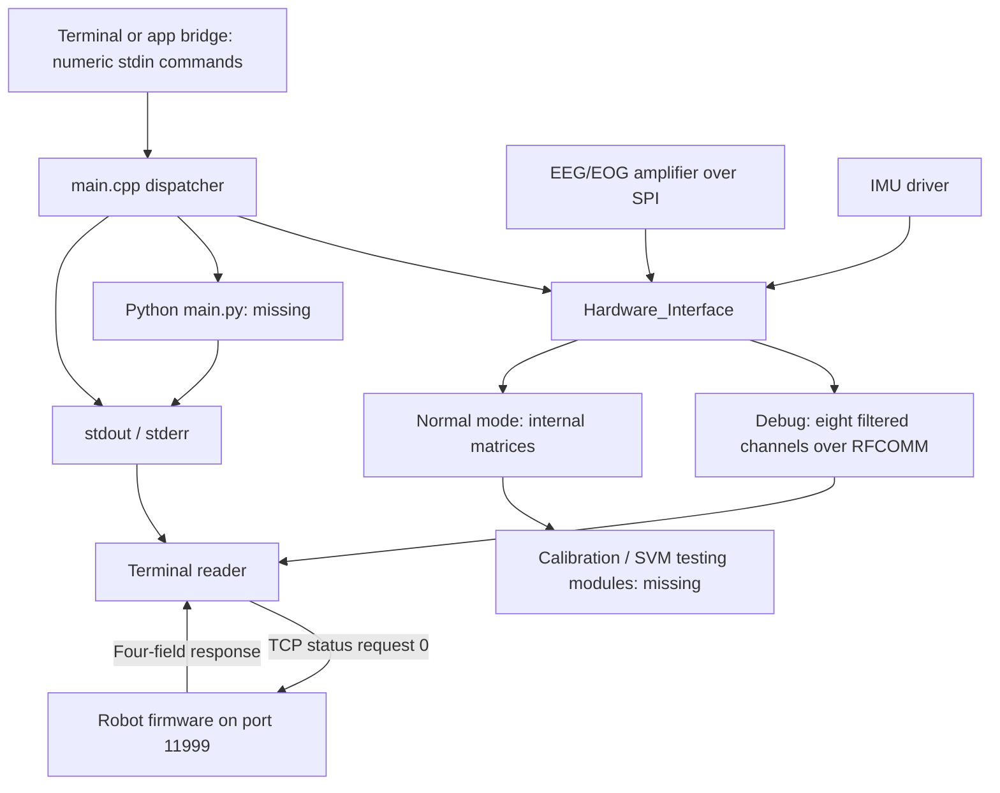

# Current BLE arm interface

The hardware interface now implements the NeuroExo trial protocol over BlueZ
BLE GATT. See [NEUROEXO_PROTOCOL.md](NEUROEXO_PROTOCOL.md) for packet definitions,
the Python reader, the C++ build/run procedure, and the matching Nano receiver.
The supplied receiver simulates position; the old angle/I2C sketch is incompatible.

The source walkthrough below is historical: it describes the pre-refactor
TCP/RFCOMM version. Its old transport APIs and several listed defects have since
been removed or corrected. Use the protocol guide for current behavior.

For the BeagleBone-to-Nano 33 BLE packet load test, use the new
[BLE benchmark procedure](BLE_BENCHMARK.md). It sends synthetic test data and
measures delivery independently of the EEG application described below.
The [hardware-eeg profile](HARDWARE_INTERFACE_BENCHMARK.md) models the active
C++ debug record format and pacing while leaving the reference C++ unchanged.

# Understanding H_Robotics_Files

This folder is a partial copy of a larger application for acquiring EEG/EOG and
IMU data, collecting training data, running a support vector machine (SVM), and
communicating with an app and a rehabilitation robot. EEG refers to brain-signal
channels; EOG refers to eye-signal channels; the IMU supplies motion measurements.

The three C++ files belong to one compiled program. You run its executable once
the complete application can be built; you do not run each `.cpp` or `.hpp` file
individually. The code targets Linux hardware: it uses `/dev/spidev1.0`, Linux
GPIO through libsoc, and BlueZ Bluetooth sockets. Comments identify a BeagleBone
Black Wireless. It is a different program from the Teensy firmware elsewhere in
this repository.

The supplied C++ application cannot currently build on its own. Required source
files are absent, and there are errors in the code that is present. The Python
reader added alongside this guide runs independently. This guide describes the
existing code without changing its hardware behavior.

| Original file | Purpose | What it outputs |
|---|---|---|
| [main.cpp](main.cpp) | Starts hardware, reads numeric commands, dispatches calibration/testing/debug modes, launches Python SVM training. | Console messages; calls to app-update functions; relayed training-script output. |
| [Hardware_Interface.hpp](Hardware_Interface.hpp) | Declares the hardware class: buffers, gains, filters, IMU, sockets, and callable methods. | No output by itself. |
| [Hardware_Interface.cpp](Hardware_Interface.cpp) | Implements amplifier setup, sample acquisition/conversion/filtering, internal sample delivery, and Bluetooth transport. | Console diagnostics; Bluetooth text records in debug mode; matrices passed inside the C++ process. |
| [nsf-tcp-protocol.md](nsf-tcp-protocol.md) | Documents the robot firmware's TCP request/response protocol on port 11999. | A reference for interpreting four-field robot responses; it is not a server implementation. |
| [manual.pdf](manual.pdf) | Six-page guide to rebless Wi-Fi setup, finding its IP, and selecting actuator orientation. | Instructions only. |

`read_outputs.py` and this README are new learning aids, not part of the original
application. The original reader modes have no third-party Python dependencies;
the new BLE benchmark modes require Bleak.



The robot TCP path is independent of the EEG Bluetooth path. There is no single
existing stream containing every measurement and status field.

**How `main.cpp` runs**

1. Constructs amplifier, IMU, calibration, testing, and hardware-interface objects.
2. Starts `inputThread()` to wait for newline-terminated commands on standard input.
3. Sets up GPIO 115 for falling-edge input. A callback is defined to collect EEG
   and IMU data, but the supplied file does not register that callback.
4. Uses hardcoded settings: accelerometer sensitivity `6384`, gyroscope
   sensitivity `131`, EOG gain index `6`, and EEG gain index `0`. The old
   command-line argument parsing is commented out; passing different arguments
   does not change these values. `time_command = 2` is also unused here.
5. Initializes separate hardware interfaces owned by calibration, testing, and
   debug, plus a separate amplifier object for impedance measurement.
6. Puts `top_hI` into debug mode, connects to the update server through a missing
   helper, and waits in the command loop.
7. Dispatches requested operations until `gV.EMERGENCY_STOP` becomes true.
   While idle, it sleeps for 100 ms per iteration.

`gV` is shared application state: settings, procedure, therapy stage, task,
position, trial labels, stop flags, and predictions. Its definition is missing,
so defaults, thread synchronization, and the app-server implementation cannot be
checked here.

The numbers typed into stdin differ from the internal `switch` case numbers:

| Type this exact line into the C++ program | Intended action | Internal case / behavior |
|---|---|---|
| `1` | Receive settings from Python | Runs settings connection and receive helpers in the input thread. |
| `2` | Begin impedance check | Case 0 calls `amp.impedance()`. |
| `3` | Stop impedance check | Sets `stopRequested`, clears `amp.impedanceStreamActive`, returns command to idle. |
| `4` | Begin the configured sequence | Case 1 for a procedure containing `Training`; case 3 for `Testing`. |
| `5` | Send files | Only prints a message in the supplied handler. |
| `6` | Request application emergency stop | Sets `gV.EMERGENCY_STOP`; response depends on active modules observing it. |
| `7` | End the current stage | Sets `gV.END_STAGE`. This is different from internal case 7, which means idle. |
| `8` | Train the SVM | Case 2 launches `python3 main.py ...`. |
| `9` | Debug EEG/EOG | Case 4 calls `top_hI.callEEG(nullptr, nullptr)`. |
| `0` | Debug the arm | Case 5 calls disabled arm code and the broken TCP cleanup function. |
| `10` | Synchron/iPad test | Case 6 calls a testing-module option whose implementation is absent. |

These are **application stdin commands**, not robot TCP commands. For example,
stdin `0` requests arm debug, while TCP `0` requests status. Stdin `6` is a
software flag, not the robot's TCP motor-off command. Do not infer physical stop
behavior from a missing module.

The input parser calls `stoi()` without handling conversion errors, then uses
substring matching for many commands. Blank/text input can terminate the process;
multi-digit inputs can match unintended actions. It also spins on EOF. Use exact
documented numeric lines when the application has been restored. Stage flags
are not visibly reset here, and calibration/testing cases do not visibly reset
the command after completion; their missing `endModule()` methods may handle
that, but it cannot be confirmed.

`train_svm()` assembles a shell command with the requested training options and
runs it through `popen()`. It relays Python stdout to C++ stdout and looks for a
`MODEL_FILE:` marker. On success it prints `Training completed successfully!`
and `Model saved to: ...`; the caller passes the returned path to
`send_specific_file()`, whose implementation is missing. Python stderr is not
captured by `popen(..., "r")`, although a parent reader merging stdout/stderr can
capture both. The training script and its output-file format are absent.

The data and model folders are hardcoded to `/home/debian/Desktop/subject` and
`/home/debian/Desktop/subject_model`. `python3 main.py` resolves relative to the
process's working directory, despite the comment referring to the executable's
directory. The marker parsing skips 11 characters even though `MODEL_FILE:` is
10 characters, so it assumes one following space. Its 128-byte read buffer can
also split long output lines.

**What the hardware interface does**

The header is the class's inventory, and the `.cpp` file supplies the actions.
`fd` identifies the amplifier's SPI device; `trx` describes one SPI transfer;
`tx_buff_2`/`rx_buff_2` hold outgoing/incoming bytes. `btSocket` is a separate
Bluetooth connection. `Channel<MatrixXd>` is an internal C++ delivery mechanism,
distinct from both an electrode channel and a network socket.

| Function(s) | Role |
|---|---|
| `startAmp()` | Opens SPI, configures mode/speed and 27-byte transfers, constructs filters, initializes H-infinity state. Reports errors and exits on several setup failures. |
| `setAmpEeg()`, `setAmpEog()`, `getAmpEog()` | Store gain indices or retrieve the EOG index. `getAmpEeg()` is declared but has no definition in the supplied file. |
| `startUpSequence()` | Sends register/command bytes for sampling configuration, bias, initially shorted inputs, and acquisition control. The comment identifies `0x96` as 250 Hz. |
| `startEegStream()` | Applies EEG/EOG gains and reference/bias configuration, prints a register readback in hexadecimal, and starts acquisition. |
| `startUp()` | Calls `startUpSequence()` and `startEegStream()`. |
| `changeBuff()`, `sendCommand()` | Copy outgoing bytes and invoke the SPI transfer. `sendCommand()` expects a 27-byte command buffer. |
| `getRawRx()` | Returns a pointer to the current received bytes; does not print or transmit them. |
| `callEEG()` | Wrapper around the sample loop in `measureEEGEOG()`. |
| `measureEEGEOG()` | Acquires, converts, filters, adds IMU/task information, then streams debug values or passes matrices to other modules. |
| `toVoltage()` | Converts eight signed 24-bit samples into intended voltage values. |
| `FilterVoltage()` | Applies high-pass, H-infinity, and low-pass processing to all eight channels. |
| `HInfFilter()` | Separate placeholder that only copies its input. The actual H-infinity call used above is `Hinf_RT_Filter_v2016_2_11()`, whose definition is absent. |
| `testEegStream()`, `testAmp()` | Configure the amplifier's internal test-signal mode; these are not the debug command's acquisition loop. |
| `debugMode()`, `leaveDebugMode()`, `setModule()` | Select debug behavior or identify the caller as calibration/testing. |
| `setBluetoothDevice()` | Stores the receiver's MAC address and RFCOMM channel; it does not connect yet. |
| `connectToBluetoothDevice()` | Creates an RFCOMM client socket and connects to a listening receiver. |
| `sendBluetooth()`, `receiveBluetooth()`, `disconnectBluetooth()` | Send text, receive a chunk with a timeout, or close Bluetooth. Receiving a chunk does not guarantee a whole line. |
| `sendEEGEOGToApp()` | Serializes eight filtered channels separated by semicolons and ending in newline. Called by the debug acquisition path. |
| `sendFullDataToPython()` | Despite its name, sends Bluetooth CSV: five EEG values, position, imagine, move. No caller appears in the supplied code. |
| `Arm_setup()`, `debugArm()` | Disabled TCP-arm stubs. Setup prints a message and returns a maximum position of zero. |
| `connectToPythonServer()`, `sendPositionToPython()`, `sendCommandToPython()` | Disabled legacy TCP-bridge functions. These differ from the global settings/update helpers still called by `main.cpp`. |
| `disconnectPython()` | Legacy socket cleanup. |
| `recvImmediate()`, `sendWithTimeout()`, `extractThirdToken()` | Legacy socket readiness/receive/send helpers and a whitespace-token parser. The third token corresponds to position in a robot response. |
| `closeTCPConnection()` | Intended TCP cleanup, but its body contains leftover code and misplaced braces. It is not a functioning disabled stub. |

Inside `measureEEGEOG()`, each iteration:

1. Performs a 27-byte SPI exchange. The conversion path skips three leading
   bytes and treats the remaining 24 as eight three-byte samples.
2. Sleeps 4 ms and collects IMU data. The intended rate is approximately 250
   samples/second, but the loop adds processing and I/O time and does not prove
   an exact 250 Hz rate. The old 25-sample batch loop is commented out.
3. Converts samples into a `1 x 8` matrix: EEG1–EEG5, then EOG1–EOG3.
4. Calls `FilterVoltage(..., 8.0)`: intended 8 Hz high-pass, H-infinity filtering,
   then 30 Hz low-pass, all using a nominal 250 Hz sample rate.
5. Reads the latest IMU string, expected as
   `IMU: accel_x accel_y accel_z gyro_x gyro_y gyro_z`, and extracts acceleration.
6. In debug mode, sends the eight filtered values over Bluetooth if connected.
   In normal mode, builds the larger matrix described below and sends it to the
   supplied internal channels.
7. Stops on end-stage/emergency flags, or after one minute when the stage is
   `stare`, then disconnects Bluetooth.

**Every output path and its format**

| Path | Format / contents | Available to a separate reader? |
|---|---|---|
| stdout / stderr | Startup messages, diagnostics, stage endings, training output, and SPI setup hex readback. | Yes, from an executable's pipe or saved log. Most sample-printing blocks are commented out. |
| Debug Bluetooth | `eeg1;eeg2;eeg3;eeg4;eeg5;eog1;eog2;eog3\n` | Yes after build repairs, receiver setup, and Bluetooth-address configuration. No position, IMU, timestamp, or prediction fields. |
| Full-data Bluetooth helper | `eeg1,eeg2,eeg3,eeg4,eeg5,position,imagine,move\n` | Format is implemented, but no supplied caller emits it. Floating values use nine decimal places. |
| Calibration matrix | 14 values, described below. | Internal only until an exporter is added. |
| Testing matrix | 15 values, described below. | Internal only until an exporter is added. |
| IMU string and raw SPI bytes | Six IMU values in memory; 27 raw received bytes in memory. | No continuous external exporter in these files. `voltageMatrix` provides eight converted values before filtering. |
| Settings / updates | Calls such as `sendUpdateToPython("therapy_stage", "stare")`, or error keys `ARM`/`ZEROS`. | Server addresses, ports, and framing are unknown because helper definitions are absent. These calls are not necessarily stdout. |
| Impedance results | Generated by `amp.impedance()`. | Exact fields/units/transport are unknown because the amplifier implementation is absent. |
| Saved datasets / model | Missing modules may save datasets; Python returns a model-file path. | Dataset names, layouts, and model contents cannot be inferred from the supplied files. Declared `ofstream`s in `main.cpp` are not opened/written there. |
| Robot TCP | `drive_mode\tactual_curr\tactual_pos\tmax_curr\n` | Read directly from matching robot firmware after a request on port 11999. |

Indices below are zero-based, as in C++ and Python:

| Columns | Calibration (`1 x 14`) | Testing (`1 x 15`) |
|---|---|---|
| 0–4 | Five filtered EEG values | Five filtered EEG values |
| 5–7 | Three filtered EOG values | Three filtered EOG values |
| 8–10 | Acceleration X, Y, Z | Acceleration X, Y, Z |
| 11 | `-stoi(gV.POSITION)` for `flexion`; otherwise `50 - stoi(gV.POSITION)` | `stoi(gV.POSITION)` |
| 12 | Imagine flag | Movement-predicted flag |
| 13 | Move flag | Imagine flag |
| 14 | Absent | Move flag |

All entries are set to `9999` when `END_OF_TRIAL` or the baseline timer signals
completion. This is a control marker, not a measurement. The exact calibration
module string tested in the source is misspelled: `callibration_collection`.
Position here comes from shared state, not a direct encoder read in this method.
Gyroscope readings are parsed into a vector but not included in either matrix.

The conversion code intends volts, but gain handling must be corrected before
trusting scale. IMU units cannot be verified without its driver; the TCP guide
does not explicitly state current/position units. The reader preserves numeric
values and does not invent unit labels or convert them. Neither existing
Bluetooth format includes a sensor timestamp or sequence number; reader
timestamps are the computer's receipt/display times.

**What the two supplied documents tell you**

`manual.pdf` covers the following pages:

| Page | Content |
|---|---|
| 1 | Power on rebless; green LED means Wi-Fi connected and blue means awaiting connection. Describes the RST button for standby. |
| 2 | ESP SoftAP Provisioning app setup with username `rebless`. |
| 3 | Joining the device's provisioning network and entering its setup PIN. |
| 4 | Selecting a 2.4 GHz Wi-Fi network; mentions an iOS indication issue and power cycling. This is a statement in the supplied manual, not a check of current app behavior. |
| 5 | Finding the robot IP in Windows PowerShell using `Resolve-DnsName rebless`. |
| 6 | Right-side default orientation; describes `9\t1` for left and `9\t2` for right, and effects on ROM/motor state. |

`nsf-tcp-protocol.md` describes a robot that accepts short tab-separated text
requests on TCP port `11999` and replies with one newline-terminated status line
per parsed request. It does not describe a continuously pushed telemetry feed:
the reader must poll.

| TCP mode | Documented meaning |
|---|---|
| `0` | Request status, valid regardless of run state. |
| `1` | Set desired current; value required. |
| `2` | Set desired position; value required. |
| `3` | Select measure mode. |
| `4` | Select current-control mode. |
| `5` | Select position-control mode. |
| `6` | Set maximum current; value required. |
| `7` | Start / motor on. |
| `8` | Stop / motor off. |
| `9` | Reserved / no effective action in this protocol document. |

The guide requires measure-mode setup before actual operation, describes ROM
constraints, limits parsed commands to fewer than 30 bytes, and documents input
clamps of ±3 for current/max-current and ±150 for position. A status-only reader
can use `0` without running that motor-start sequence.

There is a direct version discrepancy: PDF page 6 assigns orientation behavior
to mode 9, while the Markdown guide calls it reserved. Match control commands to
the actual installed firmware before building control features. The included
reader sends only `0\n`, waits for its reply, and does not change modes or
setpoints. Stopping this reader does not stop a running motor.

**Why the original C++ needs work before live acquisition**

1. Missing project files: `imu.hpp`, `amp.hpp`, `globalVariables.hpp`,
   `Calibration_Collection.hpp`, `Testing_SVM.hpp`, `channel.hpp`,
   `FIR-filter-class/filt.h`, their implementations, and Python `main.py`.
   The H-infinity implementation and settings/update/file-transfer helpers are
   also not present. There is no build configuration for this folder. The
   neighboring PlatformIO projects target different firmware.
2. `closeTCPConnection()` closes its function body too early, leaving a `for`
   loop and other statements at file scope. This is invalid C++.
3. `num_to_convert` is declared as four bytes in the header, but the acquisition
   loop writes 24 bytes into it and `toVoltage()` reads 24. This is an
   out-of-bounds write that can corrupt memory.
4. The default EEG gain index 0 maps to gain 1; EOG index 6 maps to gain 24.
   `toVoltage()` nevertheless uses gain 24 for every channel. Some comments
   describe the reverse gain assignment, so follow the assignments, not those
   comments.
5. `FilterVoltage()` constructs new high/low-pass filter objects on each call.
   Since each call contains one sample, state is not retained in those objects
   across samples. Their missing implementation must be reviewed to restore
   continuous filtering. The H-infinity state is explicitly retained separately.
6. The default Bluetooth address is empty and no supplied call to
   `setBluetoothDevice()` sets it. Debug mode can acquire data and only print
   `Bluetooth address not configured...`, with no Bluetooth telemetry sent.
7. IMU parsing assumes `s.back()` exists and at least three numbers were parsed;
   those assumptions are not checked. The command parser and shared-state
   lifecycle have the limitations described earlier.
8. Socket helpers use single `send()` calls without retrying partial writes.
   `recvImmediate()` also has a fixed 1000-byte buffer but accepts an arbitrary
   maximum-read argument. Transport handling needs review before relying on
   complete telemetry records.

A syntax-only attempt, `g++ -std=c++17 -fsyntax-only
H_Robotics_Files/main.cpp`, stops immediately at the missing `imu.hpp`. It does
not establish the rest of the program's build correctness. The hardware
application has not been executed.

**Using the terminal reader**

For device-by-device setup, pairing, start/stop commands, expected output, and
troubleshooting, follow the
[BeagleBone terminal-reader procedure](BEAGLEBONE_READER_PROCEDURE.md).

Run these commands from the repository root. On Windows, use `python` or `py -3`
in place of `python3` if that is how Python is installed.

Start with the hardware-free demo:

```bash
python3 H_Robotics_Files/read_outputs.py demo
```

It prints labeled examples for logs, eight-channel EEG/EOG, full-data CSV, robot
status, model paths, and proposed raw/IMU/calibration/testing exporters. These
are synthetic examples, not recorded measurements. Unknown lines remain visible
as logs; malformed tagged records remain visible as `UNPARSED`.

Read an existing text capture:

```bash
python3 H_Robotics_Files/read_outputs.py stdin < capture.txt
```

Once the complete C++ application has been restored and built, a Linux shell
pipeline can capture its console messages (the executable path is illustrative):

```bash
./main 2>&1 | python3 H_Robotics_Files/read_outputs.py stdin
```

Here `2>&1` combines diagnostic stderr with stdout; `|` feeds that text to the
reader. C++ stdin still comes from the terminal, so its numeric commands can be
entered there. This pipeline only sees text the producer prints. It cannot
extract internal matrices or Bluetooth traffic. Line readers also wait for a
newline: the existing startup hex `printf()` does not supply one and may merge
with later text. Flush and newline-terminate any new telemetry records.

To inspect matching robot firmware directly, replace the example IP:

```bash
python3 H_Robotics_Files/read_outputs.py tcp 192.168.1.50 --count 10
```

This works independently of the broken C++ program. It defaults to port 11999,
a half-second pause between completed polls, and a five-second connect/read
timeout. Omit `--count` to continue until Ctrl+C. On disconnect or timeout it
reports the error and exits; run it again to reconnect. Use a reachable robot
address on the configured network. It needs firmware implementing the supplied
protocol; this was not tested against a physical robot.

To receive debug EEG/EOG on a Linux computer with a working Bluetooth adapter:

```bash
python3 H_Robotics_Files/read_outputs.py bluetooth --channel 1
```

The C++ program is the RFCOMM **client**, so the reader is the listening
**server**. Configure `top_hI` in the restored application before debug
acquisition, using the receiver computer's real Bluetooth MAC:

```cpp
top_hI.setBluetoothDevice("AA:BB:CC:DD:EE:FF", 1); // replace example MAC
```

Start the reader first, then run the repaired application and enter `9` into
its stdin. Adapter permissions and pairing/trust must already be configured as
required by the operating system. The listener uses a fixed RFCOMM channel and
does not advertise a service through SDP. It accepts one sender and reports
disconnect as an error; restart it for another session.

Although some code comments say BLE, the actual transport is
`BTPROTO_RFCOMM`, which is Classic Bluetooth. A BLE GATT notification reader is
not compatible with that socket protocol. Bluetooth mode needs Linux/BlueZ
support; an ordinary Windows Python install or WSL instance without a usable
Bluetooth adapter cannot be assumed to support it. Demo/stdin/TCP modes do not
require BlueZ.

Run separate reader processes in separate terminals to view console, Bluetooth,
and robot status together. They remain separate sources, without synchronized
sample timestamps. Saving the displayed text is optional:

```bash
python3 H_Robotics_Files/read_outputs.py demo > terminal_capture.txt
```

**Making the currently internal outputs readable later**

After fixing acquisition and restoring the missing files, add an explicit
exporter at the point where the desired values exist. The added reader already
understands the following proposed tags; the original C++ does not emit them:

| Proposed line | Where values exist |
|---|---|
| `RAW,<8 comma-separated numbers>\n` | `voltageMatrix` before filtering. These are converted values, not raw ADC bytes. |
| `IMU: <6 space-separated numbers>\n` | `lastData` after `imu_cp.s.back()`, once validated. |
| `CAL,<14 comma-separated numbers>\n` | Normal-mode calibration `outputMatrix`, before internal channel sends. |
| `TEST,<15 comma-separated numbers>\n` | Normal-mode testing `outputMatrix`, before internal channel sends. |

For example, this illustrates exporting the completed normal-mode matrix inside
`measureEEGEOG()`, immediately before `channel1->send()` / `channel2->send()`:

```cpp
std::ostringstream record;
record << std::setprecision(9);
record << (module == "callibration_collection" ? "CAL" : "TEST");
for (int col = 0; col < outputMatrix.cols(); ++col) {
    record << ',' << outputMatrix(0, col);
}
record << '\n';
std::cout << record.str() << std::flush;
```

This is an insertion example, not a standalone C++ program or an applied patch.
Coordinate stdout writes across threads, or use a dedicated telemetry stream,
to keep logs from interleaving with records. Continuous terminal printing can
also slow the acquisition loop; add sample timestamps/sequence numbers at the
producer if timing or loss detection matters. For a future combined display,
use those explicit fields instead of treating receipt time as sample time.

The reader's structure is deliberately small: input modes obtain text,
`read_record()` reconstructs newline-delimited socket records,
`decode_line()` recognizes field layouts, and `display()` labels them. Extend
the decoder only after establishing a producer's actual format. Impedance,
settings/update messages, and dataset files require their missing source code
before a reliable decoder can be written.

For comparison with the other open IDE tab,
`DemoFolder/src/bluetoothTest.cpp` prints its encoder, target, interpolated
setpoint, voltage, and motion status through `Serial` once per second, with
`Serial.begin(115200)`. Those are firmware serial-port outputs, distinct from
this folder's process stdout and RFCOMM stream. The corresponding PlatformIO
serial monitor, or a separate serial-port reader, is needed for that program.

Validation of the new reader covers its synthetic examples, parsing, fragmented
newline records, and status-only request behavior using a mocked peer. Actual
SPI acquisition, Bluetooth connectivity, and robot firmware responses remain
unverified without the complete software and connected hardware.
